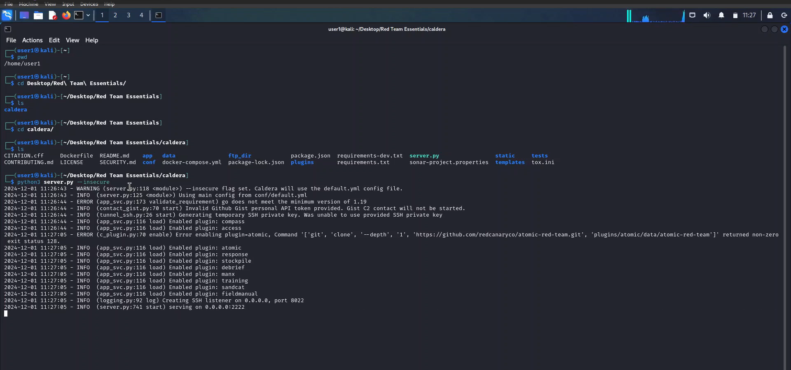

# Red Teaming | Blue Teaming Lab

## Red Team Adversary Emulation with Caldera

### Project Overview
This project aims to simulate real-world cyber attacks using Caldera, an automated adversary emulation platform built on the MITRE ATT&CK™ framework. The goal is to test and improve the organization's defenses by emulating advanced persistent threats (APTs) and other adversary techniques.

### Objectives
Understand Caldera: Familiarize with Caldera's features and capabilities.

Set Up Environment: Prepare the necessary hardware and software.

Create Adversary Profiles: Develop profiles for different types of adversaries.

Execute Emulation: Run adversary emulation scenarios.

Analyze Results: Evaluate the effectiveness of defenses and identify vulnerabilities.

Report Findings: Document the findings and provide actionable recommendations.

### Prerequisites
Hardware: 8GB+ RAM, 2+ CPUs

Software: Linux server (Ubuntu 20.04 recommended), Python 3.6.1+, Pip3, Git

Skills: Familiarity with Linux system administration, TCP/IP, penetration testing concepts, and Windows.

### Setting Up Caldera

1. Clone the Caldera GitHub Repository

git clone https://github.com/mitre/caldera.git

2. Navigate to the Caldera directory and install the python modules/dependencies

pip3 install -r requirements.txt

3. Initialize the Caldera server

python3 server.py --insecure

*Ref 1: Initializing Caldera*

4. Access the Caldera Web interface

e.g; http://server-ip:8888

5. Login to Caldera 

Credentials: red/admin

*Ref 2: Caldera Login*

### Campaigns

Step 1: Deploy an Agents

*Ref 3: Deploying Agents*

Step 2: Abilities

*Ref 4: Abilities*

Step 3: Adversaries

*Ref 5: Adversaries*

Step 4: Setting up Operations

*Ref 6: Setting Caldera Operations*

Step 5: Exporting the results

*Ref 7: Exporting the results*

## Covenant C2

### Installation

Prerequisites

1. Windows GIT client

https://git-scm.com/downloads/win

2. DotNet Core 3.1

https://dotnet.microsoft.com/download/dotnet/3.1

Note:

1. Download and Install Git client and DotNet Core 3.1

*Ref 1: Installation*

3. Set Defender Exclusions.

*Ref 2: Setting Exclusions*

5. Clone the GitHub Repository

git clone --recurse-submodules https://github.com/cobbr/Covenant

*Ref 3: Cloning the Repository*

4. Start Covenant

dotnet run

*Ref 4: Initializing the Covenant*

5. Open a web browser and navigate to https://127.0.0.1:7443/

*Ref 5: Caldera Web Interface*

### Creating a Listener
### Start a Listener
### Set Up a Launcher
### Executing the Grunt

## Havoc C2

Installation

sudo apt install havoc

Start the havoc C2 server

havoc server --profile ./profiles/havoc.yaotl -v --debug

Start havoc C2 client

havoc client

### Running Havoc C2

1. Create a Listener
2. Generate a payload
3. Download and Execute a payload

## Atomic Red Team

Introduction

Installation

1. Open the PowerShell and run as administrator.
2. Execute the following commands:
powershell -exec bypass
Install-Module -Name invoke-atomicredteam,powershell-yaml -Scope CurrentUser
3. Import the Modules
Import-Module "C:\AtomicRedTeam\invoke-atomicredteam\Invoke-AtomicRedTeam.psd1" -Force

## Mitre Att&ck Framework

# Running Atomic Tests

(PowerShell Commands)

1. Invoke-AtomicTest T1016 -ShowDetailsBrief
2. Invoke-AtomicTest T1016 -ShowDetails
3. Invoke-AtomicTest T1016 -CheckPrereqs
4. Invoke-AtomicTest T1016 -GetPrereqs
5. Invoke-AtomicTest T1016
6. Invoke-AtomicTest T1055 -ShowDetailsBrief
7. Invoke-AtomicTest T1055 -ShowDetails
8. Invoke-AtomicTest T1055 -TestNumbers 1
9. Invoke-AtomicTest T1055 -TestNumbers 2
10.Invoke-AtomicTest T1055 -TestNumbers 3
11. Invoke-AtomicTest T1055 -CheckPrereqs
12. Invoke-AtomicTest T1055 -GetPrereqs
13. Invoke-AtomicTest T1016 -Cleanup
14. Invoke-AtomicTest T1055 -Cleanup
